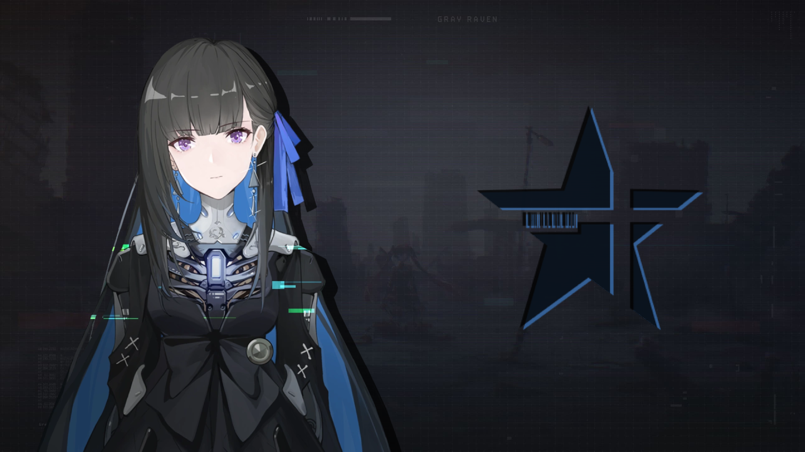

  

  <h3 align="center"> 💠 Selena 💠 </h3>
  

    Web-app component for project <a href="https://neet.kurasad.dev"><code> 4M@ </code></a>
     
    <a href="https://neet.kurasad.dev"><strong> Visit the creators » </strong></a>
     
     
    <a href="contact@ahlw.dev"> Contact </a>
    ·
    <a href="https://github.com/TeamNeet/Selena/issues"> Report Bug </a>
    ·
    <a href="https://github.com/TeamNeet/Selena/issues"> Request Feature </a>
  

### About
Selena is the web-application for the 4M@ project. Built with React.JS and SCSS.
