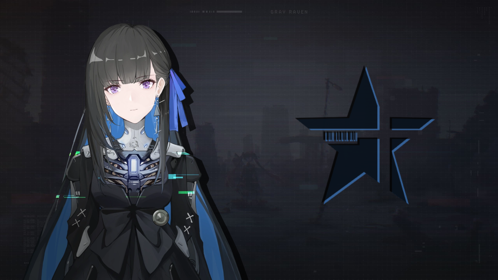

  

  <h3 align="center"> 💠 Selena 💠 </h3>
  

    Web-app component for project <a href="https://neet.kurasad.dev"><code>4M@</code></a>
     
    <a href="https://neet.kurasad.dev"><strong> Visit the creators » </strong></a>
     
     
    <a href="contact@ahlw.dev"> Contact </a>
    ·
    <a href="https://github.com/TeamNeet/Selena/issues"> Report Bug </a>
    ·
    <a href="https://github.com/TeamNeet/Selena/issues"> Request Feature </a>
  

<h3> About </h3>

 Selena is the web-application for the <a href="https://neet.kurasad.dev"><code>4M@</code></a> project. Built with React.JS and SCSS. <a href="https://neet.kurasad.dev"><code>4M@</code></a> is an open-source text editor with syntax highlighting for your coding needs. 

<h3> Table of Contents </h3>
<ul>
  <li><a href="#features"> Features </a></li>
  <li><a href="#installation"> Installation </a>  
    <ul>
      <li><a href="#prerequisites"> Prerequisites </a></li>
      <li><a href="#download"> Download </a></li>
      <li><a href="#setup"> Setup </a></li>
    </ul>
  </li>
  <li><a href="#guides"> Guides </a></li>
  <li><a href="#help"> Help </a></li>
  <li><a href="#license"> License </a></li>
</ul>

<h3>Features</h3>

<h3>Installation</h3>

<h4>Prerequisites</h4>

<h4>Download</h4>

<h4>Setup</h4>

<h3>Guides</h3>

<h3>Help</h3>

<h3>License</h3>
